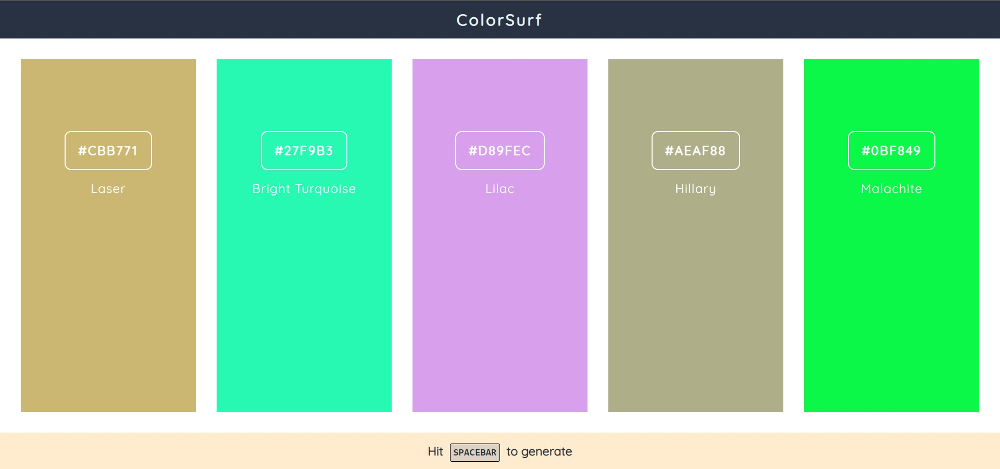

# Color Surf

This is a color palette generator web app.
Generate random colors and then lock the ones tat you like to create a color palette for your own web designs..

## Table of contents

- [Overview](#overview)
  - [Screenshot](#screenshot)
  - [Links](#links)
- [My process](#my-process)
  - [Built with](#built-with)
- [Author](#author)

## Overview

### Screenshot

### Links
- Live Site URL: [Link to the project](https://colorsurf.netlify.app)

## My process

### Built with

- HTML5
- CSS
- JavaScript

## Author

- Website - [Mohamed Farhan](https://subsurf.netlify.app)
- Twitter - [@CaptainFarhan6](https://www.twitter.com/CaptainFarhan6)
